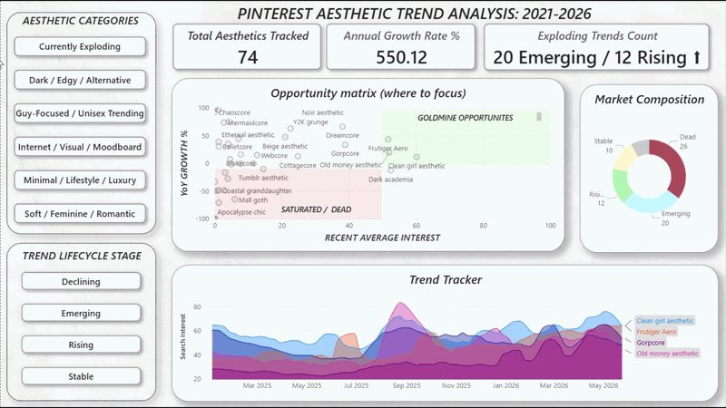

# Aesthetic Trend Intelligence (2021–2026)



An automated, end-to-end Business Intelligence pipeline that tracks, classifies, and visualizes the lifecycle of 74 distinct internet aesthetics using Google Trends interest data — built for retail, fashion, and marketing strategy.

---

## Why This Exists

Agency trend reports are expensive, opinionated, and stale by the time they land. This pipeline replaces them with a repeatable, math-driven system that runs on demand and classifies every aesthetic by where it actually sits in its commercial lifecycle — not where the internet *thinks* it sits.

The data source is Google Search interest, not social media impressions. Search measures active consumer behavior. It's a better leading indicator of retail sales than TikTok virality — and the data proves it.

---

## Key Findings (2025–2026 Window)

**35%+ of tracked aesthetics are statistically dead.**
26 of 74 aesthetics — including *Tumblr Aesthetic*, *Coastal Granddaughter*, and *Apocalypse Chic* — have flatlined near an interest score of 0–5. Brands holding inventory tied to these trends face significant markdown risk.

**Four trends occupy the Goldmine quadrant** (high baseline interest + strong upward momentum):
- Clean Girl Aesthetic
- Old Money Aesthetic
- Dark Academia
- Frutiger Aero

**TikTok virality ≠ search interest.**
Several aesthetics assumed to be "currently exploding" (e.g., *Tomato Girl Summer*) failed the objective interest-score threshold. A trend that generates impressions but not searches is a media trend, not a market trend.

---

## Lifecycle Classification

Every aesthetic is classified into one of six stages based on a trailing 52-week vs. previous 52-week mathematical comparison:

| Stage | Definition |
|---|---|
| **Emerging** | Low absolute interest, extreme growth (>50% YoY) |
| **Rising** | Consistent steady growth (>15% YoY), not yet at peak |
| **Peaking** | Current 8-week interest within 80% of all-time high |
| **Declining** | Past peak, negative growth (<-20% YoY) |
| **Stable** | Moderate interest, flat growth — evergreen but not accelerating |
| **Dead** | Flatlined near 0–5, zero recent growth |

---

## A Note on the Data

Google Trends does not return raw search volumes. It returns a normalized interest score from 0 to 100, relative to the peak within a given batch and time window. This means the pipeline measures *relative momentum* — how a trend moves against its own history and against peer trends — not absolute market size. Two aesthetics can both score 80/100 while operating in very different-sized markets.

---

## Tech Stack

| Layer | Tools |
|---|---|
| Data Engineering | Python — `pandas`, `pytrends`, `numpy` |
| Pipeline Automation | Exponential backoff to handle Google Trends rate limiting |
| Visualization | Power BI — cross-filter Matrix visuals, dynamic Top N filtering, custom layered UI |

---

## Run It Locally

**1. Clone the repository**
```bash
git clone https://github.com/angelvbenit/aesthetic-trends.git
cd aesthetic-trends
```

**2. Set up environment and install dependencies**
```bash
python -m venv venv
source venv/bin/activate       # Windows: venv\Scripts\activate
pip install -r requirements.txt
```

**3. Run the data pipeline**
```bash
python run_pipeline.py
```
> Note: The script includes automatic delays to prevent IP bans from the Google Trends API.

**4. Open the dashboard**
Open `dashboard.pbix` in Power BI Desktop and click **Refresh** to load the newly generated datasets.

---

## Limitations

- **Proxy data:** Google Search interest lags behind Pinterest/TikTok visual discovery by several weeks. This pipeline measures purchase intent, not inspiration.
- **Relative scoring:** Google Trends normalizes on a 0–100 scale per batch — the matrix measures *relative momentum* against peer trends, not absolute market size.
- **Viral noise:** A 4-week moving average smooths most spikes, but a single viral weekend can occasionally trigger a false-positive "Emerging" flag.

---

## License

MIT — use it, fork it, extend it.
